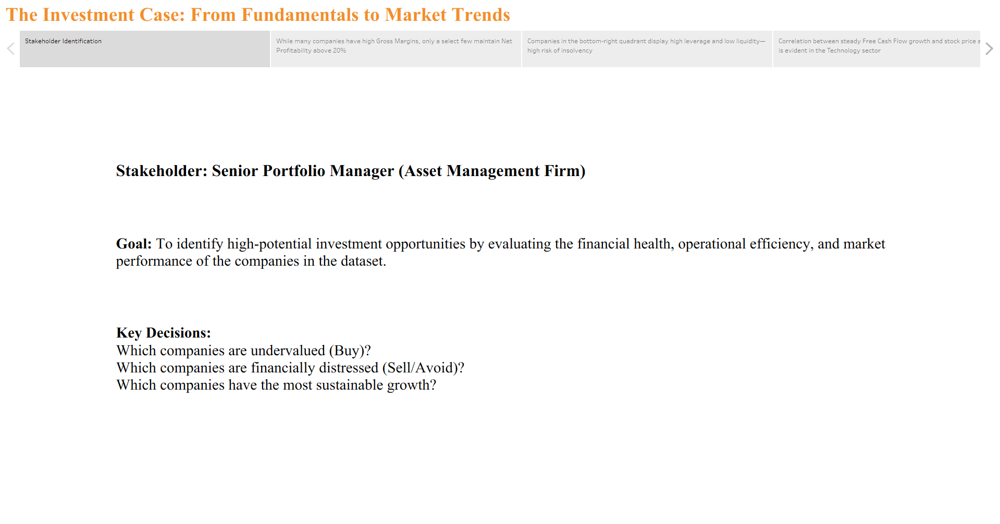
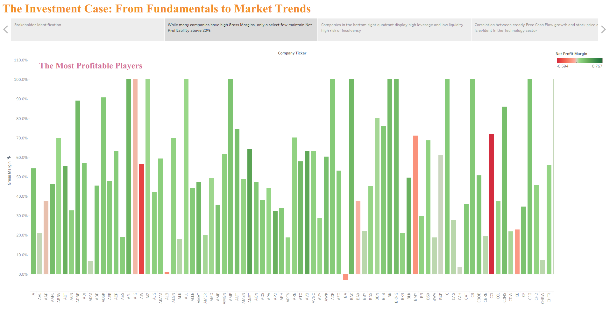
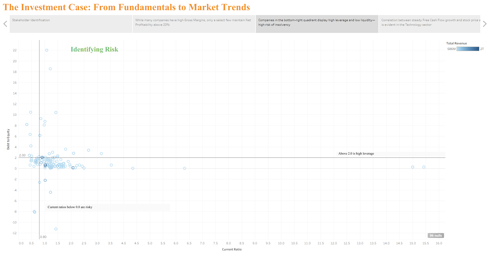
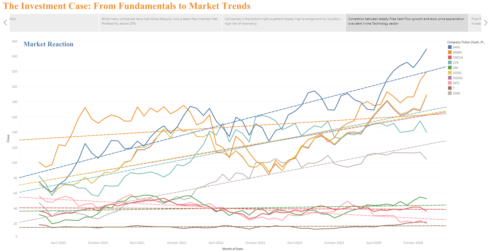
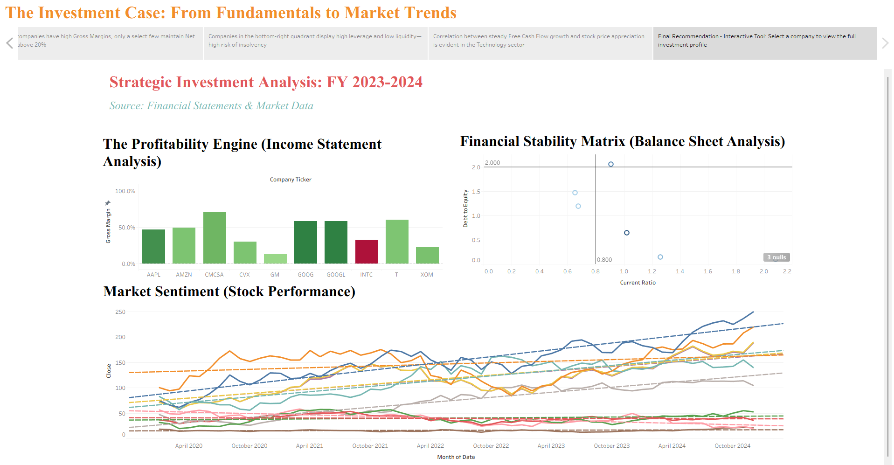

# 📊 Corporate Financial Analysis: Ratios, Risk & Market Reaction

## 🔎 Overview
This project analyzes corporate financial performance using data from the Income Statement, Balance Sheet, Cash Flow Statement, and Stock Market Prices.

The goal is to understand how changes in financial fundamentals (cause) influence valuation metrics and stock price movements (effect).

🔗 **Live Tableau Dashboard:**  
https://public.tableau.com/app/profile/ch.sri.rama.seshu.p/viz/CorporateFinancialAnalysisRatiosRiskMarketReaction/TheExecutiveDashboard

---

## 🎯 Objective
Build interactive dashboards that help:
- Investors evaluate financial health
- Analysts interpret risk and valuation trends
- Stakeholders understand market reactions to financial performance changes

The project connects financial ratios with stock price behavior to explain investor sentiment and valuation shifts.

---

## 📂 Datasets Used
- Income Statement (2022–2024)
- Balance Sheet (2022–2024)
- Cash Flow Statement (2020–2024)
- Monthly Closing Prices (5 Years)

---

## 📈 Key Financial Ratios

### Profitability
- Gross Margin  
- Operating Margin  
- Net Profit Margin  
- EBITDA Margin  
- Earnings Per Share (EPS)

### Efficiency
- Return on Assets (ROA)  
- Return on Equity (ROE)  
- Return on Capital Employed (ROCE)  
- Asset Turnover  
- Inventory Turnover  

### Liquidity & Risk
- Current Ratio  
- Quick Ratio  
- Debt-to-Equity  
- Interest Coverage  

### Cash Flow
- Operating Cash Flow Ratio  
- Free Cash Flow Margin  
- Cash Flow to Debt  

### Market Valuation
- P/E Ratio  
- Price-to-Sales  
- Price-to-Book  
- Monthly Returns  
- Cumulative Returns  

---

## 📊 Dashboard Highlights

### Executive Dashboard
- Financial performance trends
- Risk exposure metrics
- Valuation changes over time
- Stock price movement analysis

### Strategic Insights
- Rising leverage increases valuation risk  
- Declining operating cash flow impacts investor confidence  
- Sustainable capital expenditure supports long-term growth  
- EPS growth strongly influences stock price movement  

---

## 🧠 Storytelling Framework

Financial Change → Risk Shift → Investor Reaction → Market Response

Example:
Increasing Debt-to-Equity → Higher Financial Risk → Lower Valuation Multiple → Stock Price Decline

---

## 🛠 Tools & Techniques
- Tableau Desktop
- Tableau Public
- Data Joins & Relationships
- Calculated Fields for Ratio Computation
- Time-Series Analysis
- Interactive Dashboards & Storytelling

---

## 🚀 Key Takeaway
This project bridges financial statement analysis with real-world market performance.

It demonstrates how corporate fundamentals directly influence valuation and investor behavior through data-driven insights.

---

## 📸 Dashboard Preview  

